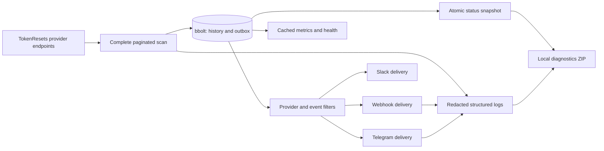

# Architecture and compatibility contracts

TokenResetsMonitor reads public announcements and sends notifications. It has no web UI or personal-account access. The CLI manages history and deliveries through private local control when the daemon is running. A separate optional local HTTP server exposes operational metrics and health; project release checks never install updates.

The implementation is divided into `internal/api`, `filter`, `model`, `config`, `state`, `monitor`, `notify`, `logging`, `platform`, `observability`, `updates`, and `cli`. New channels should implement rendering and one-attempt dispatch through the notification adapter while retaining the monitor's durable scheduling and cancellation rules.

## State and detection

The selected provider endpoints are scanned to completion. Each request URL has its own persistent ETag/body pair. Conditional responses save payload bytes without treating a first-page `304` as a global change token. The API client's pagination and provider checks reject incomplete or inconsistent scans.

The state database contains versioned metadata, provider initialization state, event snapshots/revisions, HTTP cache entries, and per-channel deliveries. A transaction records observed events and new queue items together. Baselines are committed only after a full successful provider scan. Events from that baseline remain suppressed; configuration edits do not turn the initial history into a backlog.

Pending deliveries are reconciled against current recipients and filters at startup and at accepted operational reloads. Credentials do not define recipient identity. Source revisions can change eligibility for a post-baseline event. A meaningful correction or explicit retraction of an acknowledged announcement produces a separate change notification for the same destination when its `notify_changes` option permits it. Comparisons use the destination's last acknowledged event snapshot. List disappearance is insufficient evidence of withdrawal; the monitor checks the source event's explicit status.

Opening a database for monitoring takes an exclusive process lock with a bounded timeout. Status and diagnostic commands read a separately published JSON snapshot. History and delivery commands use the daemon's authenticated local control endpoint; stopped reads use a read-only store. The protected control descriptor is separate from the public operational snapshot and is never exported. Store the database on a local disk and mount the same persistent volume across container replacements.

The queue provides at-least-once delivery around crashes, not exactly-once delivery at the recipient. One failed channel does not block the other. HTTP `2xx` acknowledges a webhook; Telegram additionally requires `ok: true`, and Slack requires HTTP 200 with an `ok` response. Retriable attempts use exponential backoff and honor `Retry-After`. Rate limits persist a cooldown for the complete destination, preventing a queue burst from bypassing the limit. Live or stopped commands requeue eligible permanent failures without changing their notification identity or bypassing destination cooldowns.

State schema 3 retains observation decisions, delivery outcomes, attempt history, and the acknowledged revision per destination. Retention can prune old detailed records while preserving replay-suppression and acknowledgement markers. Legacy records explicitly identify missing historical detail. Filter previews share the monitor's matcher but never mutate state or call a sender. See [history and delivery management](history.md).

## Webhook contract

The default body is JSON with `schema_version: 1`. The top-level contract is:

| Field | Meaning |
| --- | --- |
| `schema_version` | Standard payload schema, independently versioned |
| `notification_id` | Stable ID for this logical delivery; also the `Idempotency-Key` header |
| `detected_at` | UTC timestamp when the monitor observed the event |
| `test` | `true` for a synthetic manual delivery check |
| `event` | Source event with ID, revision, provider, type, status, dates, scope, confidence, and links |
| `kind` | Optional change type: `correction` or `retraction`; absent for ordinary announcements |
| `previous_event` | Optional snapshot previously acknowledged by this destination |
| `changes` | Optional field comparisons between the previous and current announcement |
| `related_notification_id` | Optional ID of the prior acknowledged notification |
| `previous_event_unverified` | Optional `true` when legacy storage cannot prove the exact previously acknowledged snapshot |

Within `event`, `provider.slug` identifies the source provider and `event_type` retains its original meaning. `announced_at`, `published_at`, `effective_at`, and optional scheduled/observed dates describe different points in time. Nullable timestamps and empty `scope.products`, `scope.plans`, or `scope.windows` arrays preserve missing source evidence. The source's evidence field is `scope.scope_evidence`. `confidence.label` is the category used for filtering; its score is informational. `links.html` points to the public source entry.

Receivers should tolerate additional object fields, persist accepted notification IDs, and return success for a duplicate they already processed. A custom `body_template` replaces the body contract but retains the notification ID header. Test requests add `X-TokenResetsMonitor-Test: true`; include `.Test` in custom templates where downstream routing relies on body fields.

## Version boundaries

The application uses SemVer. Version 1.2 writes configuration (`config_version`) 3 and bbolt metadata (`state_schema_version`) 3; webhook JSON (`schema_version`) remains 1. Version 1 and 2 configurations are normalized in memory; saving a migration is explicit. Supported old databases migrate after a backup. These versions evolve independently. Additive optional webhook fields are compatible within the same schema; changing existing meaning or removing fields requires an explicit incompatible schema transition and an application major release. Webhook change deliveries require explicit opt-in; ordinary announcement fields and identities retain their meaning.

Known old database schemas migrate transactionally after a backup. Newer unsupported schemas are refused. Configuration migration is an explicit preview/apply command and preserves the original bytes in a sibling backup. Schema zero represents the early unversioned layout; it is supported for migration testing, not a separate published stable release.

## Logging and diagnostics

The application uses `log/slog`; file logs are JSON irrespective of console format. Sanitization happens before output, and source text, credentials, headers, and HTTP bodies are not emitted as diagnostic objects. The daemon owns the rotating writer; auxiliary commands never append to its files.

Exports accept only structured log records and an allowlist of operational fields, then redact again. The archive contains a manifest with available time coverage and skipped-record counts, logs, and an optional operational snapshot. It does not contain the database, environment, or raw configuration. An export is a local artifact and does not contact a support service.

## Runtime generation and observability

A reload builds and validates the next effective configuration, drains the old workers at request boundaries, reconciles persistent deliveries, then starts the new generation. Invalid input or infrastructure changes retain the previous generation. Listener and logging output identities remain fixed until restart. Startup and reload preserve baseline/no-replay semantics.

The daemon publishes a bounded status snapshot with runtime/schema versions, active configuration generation, provider readiness, channel queue counts/cooldowns, and update-check result. Health commands and doctor read this snapshot without opening bbolt. The HTTP server uses in-memory operational state and does not run source or notification requests during scrapes.

Release compatibility is declared by a versioned `compatibility.json` asset. The checker compares supported schema ranges/platforms; missing metadata stays unknown. SemVer selects whether a release is newer but does not establish schema compatibility by itself. [Operational endpoints](observability.md) and [upgrade checks](upgrading.md) describe the public behavior.
