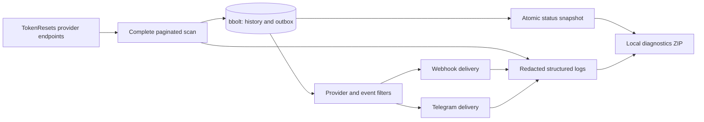

# Architecture and compatibility contracts

TokenResetsMonitor is an outbound-only process. It has no web UI, inbound server, personal-account access, or automatic updater.

The implementation is divided into `internal/api`, `filter`, `model`, `config`, `state`, `monitor`, `notify`, `logging`, `platform`, and `cli`. New channels should implement rendering and one-attempt dispatch through the notification adapter while retaining the monitor's durable scheduling and cancellation rules.

## State and detection

The selected provider endpoints are scanned to completion. Each request URL has its own persistent ETag/body pair. Conditional responses save payload bytes without treating a first-page `304` as a global change token. The API client's pagination and provider checks reject incomplete or inconsistent scans.

The state database contains versioned metadata, provider initialization state, event snapshots/revisions, HTTP cache entries, and per-channel deliveries. A transaction records observed events and new queue items together. Baselines are committed only after a full successful provider scan. Events from that baseline remain suppressed; configuration edits do not turn the initial history into a backlog.

Pending deliveries are reconciled against current recipients and filters at startup. Credentials do not define recipient identity. Source revisions can change eligibility for a post-baseline event, but an already acknowledged notification is not resent as a second reset. List disappearance is insufficient evidence of withdrawal.

Opening a database takes an exclusive process lock with a bounded timeout. Status and diagnostic commands read a separately published JSON snapshot, avoiding the database's write lock. Store the database on a local disk and mount the same persistent volume across container replacements.

The queue provides at-least-once delivery around crashes, not exactly-once delivery at the recipient. One failed channel does not block the other. HTTP `2xx` acknowledges a webhook; Telegram additionally requires `ok: true`. Retriable attempts use exponential backoff and honor `Retry-After`. An explicit command requeues eligible permanent failures after the process is stopped.

## Webhook contract

The default body is JSON with `schema_version: 1`. The top-level contract is:

| Field | Meaning |
| --- | --- |
| `schema_version` | Standard payload schema, independently versioned |
| `notification_id` | Stable ID for this logical delivery; also the `Idempotency-Key` header |
| `detected_at` | UTC timestamp when the monitor observed the event |
| `test` | `true` for a synthetic manual delivery check |
| `event` | Source event with ID, revision, provider, type, status, dates, scope, confidence, and links |

Within `event`, `provider.slug` identifies the source provider and `event_type` retains its original meaning. `announced_at`, `published_at`, `effective_at`, and optional scheduled/observed dates describe different points in time. Nullable timestamps and empty `scope.products`, `scope.plans`, or `scope.windows` arrays preserve missing source evidence. The source's evidence field is `scope.scope_evidence`. `confidence.label` is the category used for filtering; its score is informational. `links.html` points to the public source entry.

Receivers should tolerate additional object fields, persist accepted notification IDs, and return success for a duplicate they already processed. A custom `body_template` replaces the body contract but retains the notification ID header. Test requests add `X-TokenResetsMonitor-Test: true`; include `.Test` in custom templates where downstream routing relies on body fields.

## Version boundaries

The application uses SemVer, beginning with `1.0.0-rc.1`. Configuration (`config_version`), bbolt metadata (`state_schema_version`), and webhook JSON (`schema_version`) start at `1` and evolve independently. Additive optional webhook fields are compatible within the same schema; changing existing meaning or removing fields requires an explicit incompatible schema transition and an application major release.

Known old database schemas migrate transactionally after a backup. Newer unsupported schemas are refused. Configuration migration is an explicit preview/apply command and preserves the original bytes in a sibling backup. Schema zero represents the early unversioned layout; it is supported for migration testing, not a separate published stable release.

## Logging and diagnostics

The application uses `log/slog`; file logs are JSON irrespective of console format. Sanitization happens before output, and source text, credentials, headers, and HTTP bodies are not emitted as diagnostic objects. The daemon owns the rotating writer; auxiliary commands never append to its files.

Exports accept only structured log records and an allowlist of operational fields, then redact again. The archive contains a manifest with available time coverage and skipped-record counts, logs, and an optional operational snapshot. It does not contain the database, environment, or raw configuration. An export is a local artifact and does not contact a support service.
